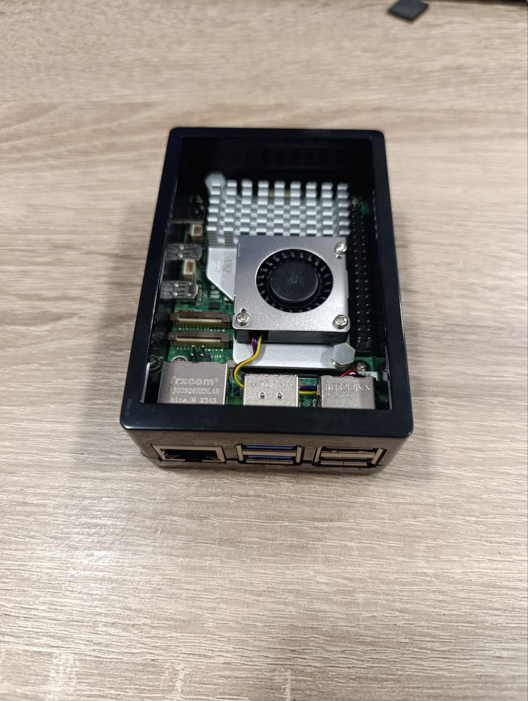
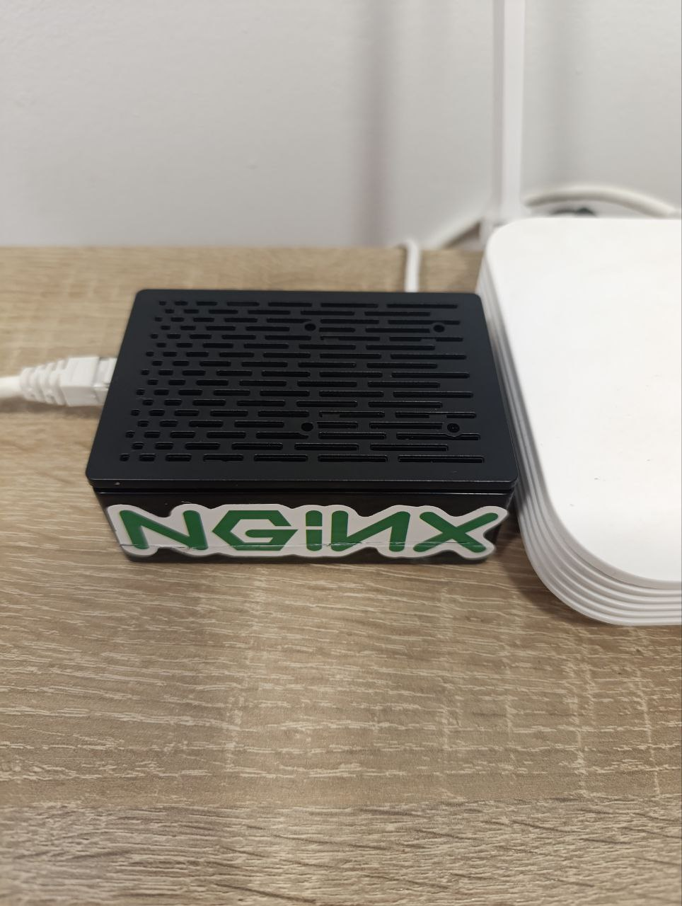

# Configuración de Servidor Web Nginx con Raspberry Pi 5

Este repositorio documenta el proceso completo de configuración de un servidor web Nginx usando una Raspberry Pi 5. El proyecto abarca tanto el hardware (componentes físicos, montaje, refrigeración) como el software (sistema operativo, servidor Nginx, seguridad, certificados SSL), proporcionando una solución completa para alojar proyectos personales web Python y funcionar como laboratorio de pruebas. Esta configuración permite experimentar con diferentes frameworks y tecnologías web en un entorno controlado y accesible.

## Hardware utilizado

### Componentes principales
- **Raspberry Pi 5 (8GB RAM)**
  - Procesador Broadcom BCM2712 Quad-Core Cortex-A76 a 2.4GHz
  - 8GB de memoria RAM LPDDR4X
  - Wi-Fi 802.11ac de doble banda
  - Bluetooth 5.0
  - 2 puertos USB 3.0 y 2 puertos USB 2.0
  - 2 puertos micro-HDMI
  - Puerto Gigabit Ethernet
  - Conector GPIO de 40 pines

- **Sistema de refrigeración**
  - Disipador de calor oficial Raspberry Pi Active Cooler
  - Disipador térmico de aluminio anodizado de una sola pieza
  - Ventilador controlado por temperatura
  - Almohadillas térmicas preaplicadas para óptima transferencia de calor

- **Almacenamiento**
  - Tarjeta microSD A1 de 256GB con velocidad de transferencia de 150MB/s

- **Carcasa protectora**
  - Carcasa específica para Raspberry Pi 5 con acceso a todos los puertos
  - Aberturas para ventilación adecuada

- **Alimentación**
  - Cargador oficial Raspberry Pi de 27W (USB-C, 5.1V/5A)
  - Cable USB-C de alta calidad para asegurar alimentación estable

### Imágenes del montaje

*La placa base de la Raspberry Pi 5 antes del montaje*


*Raspberry Pi 5 con el disipador y ventilador instalados para mantener temperaturas óptimas durante cargas prolongadas*


*Raspberry Pi 5 instalada en la carcasa con acceso a los componentes internos*


*Montaje finalizado con la carcasa cerrada, lista para funcionar como servidor*

## Configuración Inicial de la Raspberry Pi

### Instalación del sistema operativo
- Descargamos el Raspberry Pi Imager desde la [página oficial](https://www.raspberrypi.com/software/)
- Utilizamos esta herramienta para instalar Raspberry Pi OS en la tarjeta SD de 256GB
- Durante la configuración en el imager, podemos preconfigurar WiFi, SSH y otros ajustes básicos
- Conectamos la Raspberry Pi a la red mediante cable Ethernet

### Configuración básica con raspi-config
```bash
sudo raspi-config
```
- Expandimos el sistema de archivos para usar toda la capacidad de la SD
- Configuramos el autologin para escritorio
- Habilitamos SSH y VNC para acceso remoto
- Configuramos idioma (es_ES.UTF-8), zona horaria (Europa/Madrid) y teclado español
- Configuramos el país (España) para WiFi

### Configuración de red
```bash
sudo nmtui
```
- Establecimos una IP estática (192.168.1.x)
- Configuramos la puerta de enlace, en nuestro caso 192.168.1.1
- Añadimos los DNS de Google (8.8.8.8, 8.8.4.4)

### Actualización del sistema
```bash
sudo apt update
sudo apt full-upgrade
```

## Instalación y Configuración del Servidor Web

### Instalación de nginx
```bash
sudo apt install nginx
```

### Verificación del funcionamiento
```bash
sudo systemctl status nginx
```

## Configuración de Seguridad

### Configuración del firewall (UFW)
```bash
sudo apt install ufw
sudo ufw default deny incoming
sudo ufw default allow outgoing
sudo ufw allow ssh
sudo ufw allow 80/tcp
sudo ufw allow 443/tcp
sudo ufw enable
```

### Instalación y configuración de fail2ban
```bash
sudo apt install fail2ban
sudo cp /etc/fail2ban/jail.conf /etc/fail2ban/jail.local
sudo nano /etc/fail2ban/jail.local
```

Editar el archivo con la siguiente configuración:
```
[DEFAULT]
bantime = 1h
findtime = 10m
maxretry = 5

[sshd]
enabled = true
```

Activar el servicio:
```bash
sudo systemctl enable fail2ban
sudo systemctl start fail2ban
```

## Configuración de Acceso Remoto (No-IP)

### Creación de cuenta y hostname
- Creamos una cuenta en No-IP.com
- Configuramos un hostname para nuestro dominio dinámico

### Instalación del cliente DUC
```bash
cd /usr/local/src
sudo wget http://www.no-ip.com/client/linux/noip-duc-linux.tar.gz
sudo tar xzf noip-duc-linux.tar.gz
cd noip-*
sudo make
sudo make install
```
Durante la instalación configuramos las credenciales de la cuenta No-IP

### Configuración como servicio
```bash
sudo nano /etc/systemd/system/noip2.service
```

Contenido del archivo:
```
[Unit]
Description=No-IP Dynamic DNS Update Client
After=network.target

[Service]
Type=forking
ExecStart=/usr/local/bin/noip2
Restart=always

[Install]
WantedBy=multi-user.target
```

Activar el servicio:
```bash
sudo systemctl daemon-reload
sudo systemctl enable noip2
sudo systemctl start noip2
```

## Configuración del reenvío de puertos
- Accedemos a la interfaz del router (192.168.1.1)
- Configuramos en IPv4 Port Mapping:
  - Puerto 80 (HTTP): Redirigido a nuestra IP local
  - Puerto 443 (HTTPS): Redirigido a nuestra IP local

## Verificación del Funcionamiento
Verificamos que el servidor es accesible desde Internet visitando:
- http://[tu-dominio].ddns.net
- https://[tu-dominio].ddns.net (después de configurar SSL)

## Configuración de HTTPS con Let's Encrypt
```bash
# Instalación de Certbot y el plugin para Nginx
sudo apt install certbot python3-certbot-nginx

# Obtención del certificado SSL y configuración automática de Nginx
sudo certbot --nginx -d [tu-dominio].ddns.net
```

Durante el proceso de configuración:
- Proporcionamos una dirección de correo electrónico para notificaciones importantes
- Aceptamos los términos de servicio de Let's Encrypt
- El certificado se genera correctamente y se guarda en /etc/letsencrypt/live/[tu-dominio].ddns.net/
- Certbot configura automáticamente Nginx para usar HTTPS

Para comprobar la configuración de renovación automática:
```bash
sudo certbot renew --dry-run
```

## Preparar entorno para futuras aplicaciones

Esta configuración proporciona un servidor web básico con Nginx. En futuros documentos o actualizaciones se detallará cómo:

- Configurar entornos virtuales para proyectos Python
- Instalar y configurar frameworks como Django o FastAPI
- Configurar servidores de aplicación como Gunicorn o Uvicorn
- Configurar Nginx como proxy inverso para estas aplicaciones

Esta primera fase se centra en tener un servidor web funcional y seguro con capacidad de servir contenido estático.

## Monitoreo y mantenimiento

### Configurar actualizaciones automáticas de seguridad:
```bash
sudo apt install unattended-upgrades
sudo dpkg-reconfigure unattended-upgrades
```

## Notas Adicionales
- La Raspberry Pi 5 con 8GB de RAM puede manejar entre 6-8 aplicaciones web simultáneamente
- El nombre de dominio configurado en No-IP apunta siempre a la IP pública actual

## Próximos pasos
- Configuración de entornos para despliegue de aplicaciones Python (Django, FastAPI)
- Configuración de Docker para facilitar despliegues
- Implementación de monitoreo con herramientas como Prometheus o Grafana
- Configuración de copias de seguridad automatizadas
